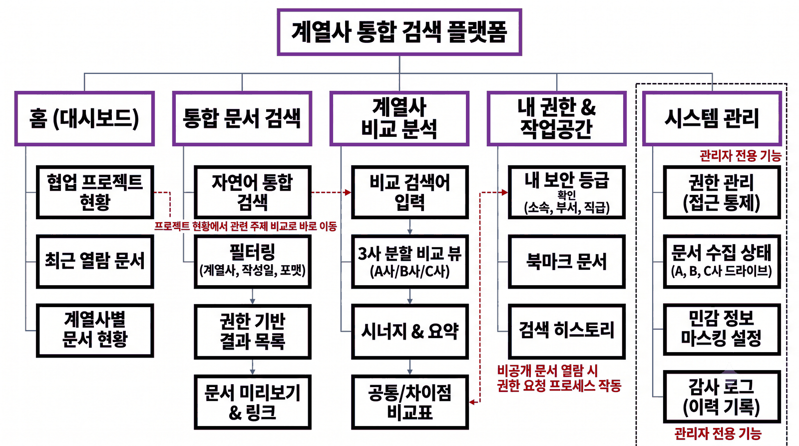

# spaceH

계열사 문서를 한 번에 검색하고, 회사별 관점을 나란히 비교하는 계열사 통합 검색 플랫폼입니다.

## 서비스 구조 (IA)



## Git 컨벤션

### 브랜치

| 브랜치 | 역할 |
| --- | --- |
| `main` | 시연 가능한 상태만 둡니다. |
| `develop` | 통합 브랜치이자 기본 브랜치입니다. 모든 작업은 여기서 분기합니다. |
| `prefix/{이슈번호}-work-summary` | 작업 브랜치입니다. |

```text
chore/1-repo-setup
chore/2-issue-template
docs/3-ia-image
```

1. 작업 전에 이슈를 만듭니다.
2. 이슈 번호로 `develop`에서 작업 브랜치를 분기합니다.
3. 작업이 끝나면 `develop`으로 PR을 보냅니다.
4. 머지한 작업 브랜치는 삭제합니다.

### 커밋

```text
prefix: #{이슈번호} 작업 요약

body
```

```text
chore: #1 기본 패키지 설정 추가
chore: #2 이슈 템플릿 추가
docs: #3 IA 이미지 갱신
```

- 요약은 한글 명사형으로 끝냅니다. (추가, 구현, 보정, 수정)
- body는 필요할 때만 씁니다.
- 커밋은 독립적으로 리뷰하고 되돌릴 수 있는 작업 단위로 나눕니다.
- 리팩터링과 동작 변경은 한 커밋에 섞지 않습니다.

#### Prefix

| Prefix | Description |
| --- | --- |
| `feat` | 새로운 기능 추가 |
| `fix` | 버그 수정 |
| `refactor` | 동작 변화 없는 코드 구조 개선 |
| `test` | 테스트 추가 및 변경 |
| `docs` | 문서 수정 |
| `chore` | 패키지, 설정, CI, 기타 작업 |
| `style` | 코드 동작 변경이 없는 formatting 변경 |
| `perf` | 성능 개선 |

### PR

- 제목은 커밋 형식을 따르되 prefix를 대문자로 쓰고 대괄호로 감쌉니다.
- 본문은 `.github/pull_request_template.md` 양식을 따릅니다.
- `develop`으로 보내는 PR은 1명 이상 승인을 받은 뒤 머지 커밋으로 합칩니다. 스쿼시하지 않습니다.
- `main`으로는 단계가 끝날 때 `develop`에서 PR을 보냅니다.

```text
[CHORE] #1 기본 패키지 설정 추가
[DOCS] #3 IA 이미지 갱신
```
